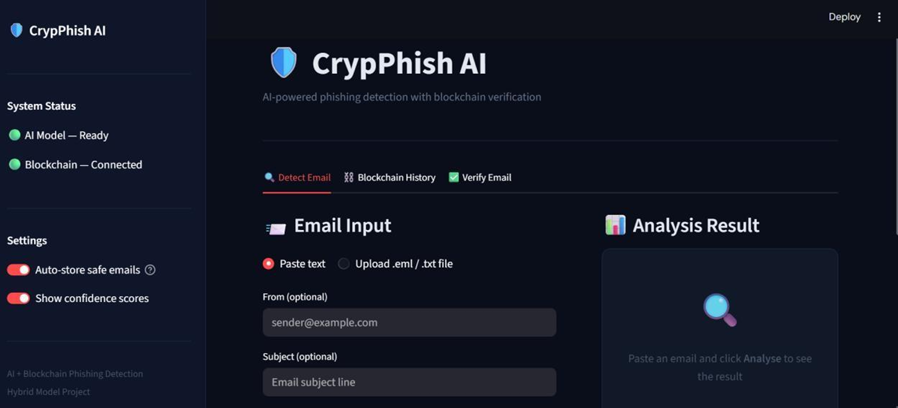
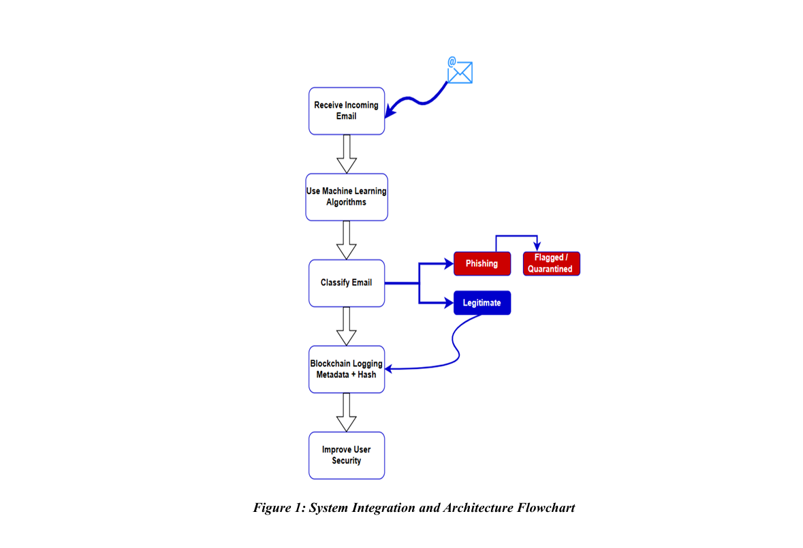

# CrypPhish-AI
<p align="center">
  
</p>


## A Hybrid Framework for Phishing Email Detection and Secure Communication Using AI and Blockchain

CrypPhish-AI is an AI-powered phishing email detection system integrated with blockchain technology to improve email authenticity, integrity, and secure communication. The project combines Machine Learning, Natural Language Processing (NLP), and Ethereum blockchain to detect phishing emails and securely record email information using smart contracts.

This project was developed as part of my M.Tech thesis in Information Security and Cyber Forensics.

## Table of Contents

- [System Architecture](#-system-architecture)
- [Key Features](#key-features)
- [Technologies Used](#technologies-used)
- [Project Structure](#project-structure)
- [Thesis](#-thesis)
- [Documentation](#documentation)
- [Installation](#installation)
- [Running the Application](#running-the-application)
- [Experimental Results](#experimental-results)
- [Future Improvements](#future-improvements)
- [Research Highlights](#-research-highlights)
- [Research Publications](#-research-publications)
- [Author](#author)
- [License](#license)

> ## Key Features

- AI-based phishing email detection
- Machine Learning and NLP-based email classification
- TF-IDF feature extraction
- Comparison of Logistic Regression, Random Forest, SVM, and LSTM models
- Ethereum blockchain integration
- Smart contract for secure email registration
- SHA-256 email hashing
- Interactive Streamlit web application
- Performance evaluation using Accuracy, Precision, Recall, F1-score, ROC Curve, and Confusion Matrix
  ## Technologies Used

### Programming Languages

- Python
- Solidity

### Machine Learning

- Scikit-learn
- TensorFlow / Keras
- TF-IDF Vectorizer

### Blockchain

- Ethereum
- Ganache
- Web3.py
- Smart Contracts

### Web Framework

- Streamlit

### Development Tools

- Jupyter Notebook
- Visual Studio Code
- Git
- GitHub

  ## Project Structure

```text
CrypPhish-AI/
├── assets/
├── blockchain/
├── datasets/
├── demo/
├── docs/
├── notebooks/
├── screenshots/
├── source-code/
├── thesis/
├── trained-model/
├── web-app/
├── README.md
├── LICENSE
└── .gitignore
```

The complete M.Tech thesis is not publicly available in this repository.

Researchers, recruiters, or academic supervisors interested in reviewing the dissertation may contact the author directly.

## Documentation

The project documentation is available in the `docs/` directory.

- Project Overview
- System Architecture
- Machine Learning Pipeline
- Blockchain Integration
- Web Application
- Installation Guide
- Deployment Guide
- Experimental Results
- Testing
- Future Work

  ## Installation

### Clone the Repository

```bash
git clone https://github.com/Kadiatou24-Diallo/CrypPhish-AI.git
```

### Navigate to the Project

```bash
cd CrypPhish-AI
```

### Install Dependencies

```bash
pip install -r requirements.txt
```
## Running the Application

Start the Streamlit application using:

```bash
streamlit run source-code/app.py
```

The application will be available at:

```
http://localhost:8501
```
## Experimental Results

The proposed framework was evaluated using multiple Machine Learning algorithms.

The evaluated models include:

- Logistic Regression
- Random Forest
- Support Vector Machine (SVM)
- Long Short-Term Memory (LSTM)

The evaluation metrics include:

- Accuracy
- Precision
- Recall
- F1-Score
- ROC Curve
- Confusion Matrix

Detailed experimental results are available in the **docs** directory.
## Future Improvements

Future enhancements of the project include:

- Multi-blockchain support
- Explainable Artificial Intelligence (XAI)
- Real-time email monitoring
- Cloud deployment
- Browser extension integration
- Mobile application support
- Smart contract optimization
- Multi-user authentication and access control
  ## Author

**Kadiatou Diallo**

M.Tech in Information Security and Cyber Forensics

Research Interests:

- Artificial Intelligence
- Cybersecurity
- Blockchain
- Phishing Detection
- Secure Communication

# 🎓 Research Highlights

This repository presents the complete research outcomes of my M.Tech in Information Security and Cyber Forensics.

The project includes:

- 📄 One M.Tech Thesis
- 📚 Two IEEE-Indexed Research Publications
- 🤖 AI-Based Phishing Email Detection System
- ⛓️ Ethereum Smart Contract Integration
- 🌐 Interactive Streamlit Web Application
- 📊 Machine Learning Model Evaluation
- 📖 Complete Technical Documentation

> **This repository contains the complete implementation, documentation, datasets, and research artifacts developed during my M.Tech research.**


# 📚 Research Publications

This project resulted in two IEEE-indexed research publications.

| Publication | Conference | DOI |
|-------------|------------|-----|
| **A Hybrid Approach for Phishing Email Detection Using AI and Cryptography** | ICPCSN 2025 | [10.1109/ICPCSN65854.2025.11035457](https://doi.org/10.1109/ICPCSN65854.2025.11035457)
| **A Hybrid Framework for Phishing Email Detection and Secure Communication Using AI and Blockchain** | ICCCA 2025 | [10.1109/ICCCA66364.2025.11325609](https://doi.org/10.1109/ICCCA66364.2025.11325609)

For detailed publication information, visit the **[publications](publications/README.md)** directory.

## 🏗️ System Architecture

The CrypPhish-AI framework integrates Artificial Intelligence and Ethereum blockchain to detect phishing emails and securely store verified email metadata.

<p align="center">
  
</p>

**Workflow Overview**

1. Receive an incoming email.
2. Analyze the email using Machine Learning algorithms.
3. Classify the email as **Phishing** or **Legitimate**.
4. Flag phishing emails for quarantine.
5. Store the hash and metadata of legitimate emails on the Ethereum blockchain.
6. Improve trust, integrity, and secure communication.

