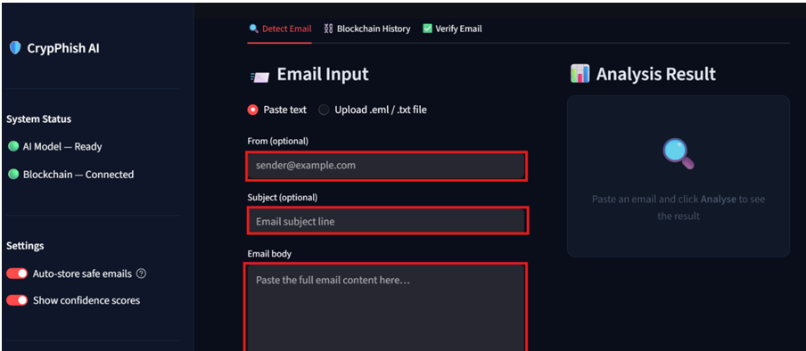
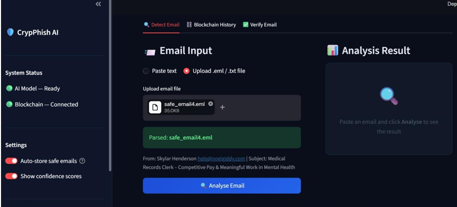
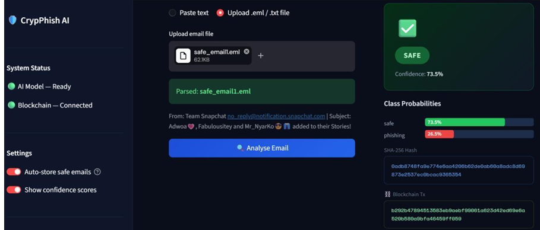
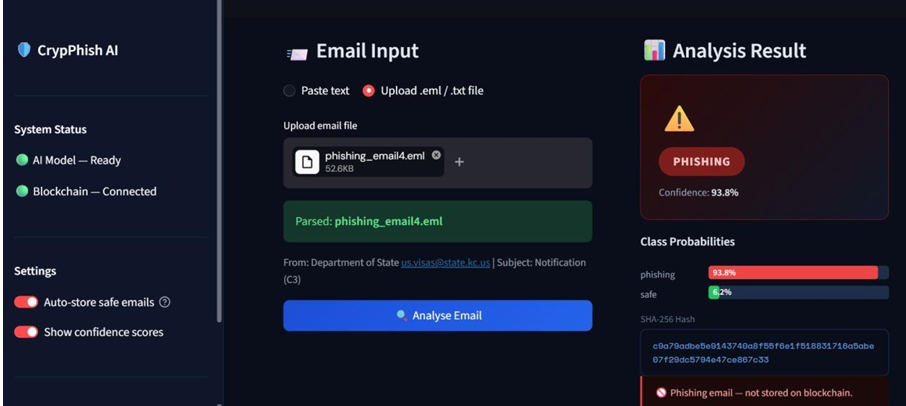
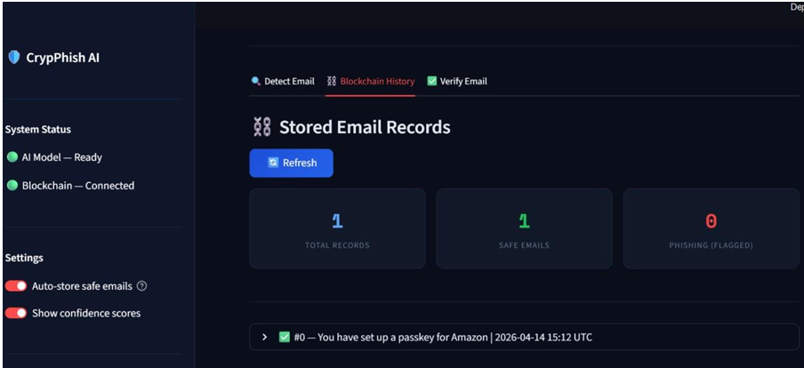
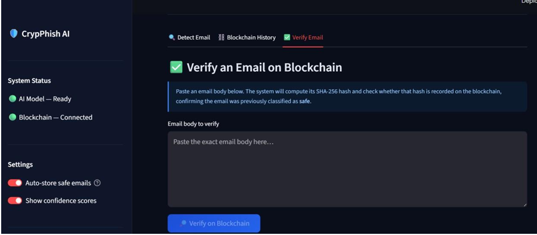

# Web Application

## Overview

CrypPhish-AI provides an interactive web application developed using Streamlit.

The application allows users to submit an email for phishing analysis and securely records legitimate email information on the Ethereum blockchain.

---

## Main Features

The web application provides the following functionalities:

- Email submission
- AI-based phishing prediction
- Prediction confidence display
- SHA-256 hash generation
- Blockchain transaction execution
- Transaction confirmation
- User-friendly interface

---

## Application Workflow

The web application follows these steps:

1. User enters an email.
2. The application preprocesses the email.
3. The Machine Learning model predicts whether the email is Legitimate or Phishing.
4. The prediction result is displayed.
5. If the email is legitimate, its metadata and SHA-256 hash are stored on the Ethereum blockchain.
6. The transaction result is displayed to the user.

---

## User Interface

The Streamlit interface consists of:

- Email input area
- Prediction button
- Prediction result
- Confidence score
- Blockchain transaction information
- Transaction status

---

## Technologies Used

| Component | Technology |
|-----------|------------|
| Web Framework | Streamlit |
| Programming Language | Python |
| Machine Learning | Scikit-learn |
| Blockchain | Ethereum |
| Smart Contract | Solidity |
| Web3 Library | Web3.py |

---

## Integration

The web application connects the following modules:

- Machine Learning Model
- Blockchain Module
- Smart Contract
- Ethereum Network

  ---

## CrypPhish AI Web Interface

The CrypPhish AI web application provides a user-friendly interface for phishing email detection and blockchain-based verification.

The application integrates the trained AI model with the Ethereum blockchain and allows users to analyze email content, upload email files, review blockchain records, and verify previously stored emails.

### Main Application Interface

The main dashboard displays the operational status of both the AI model and the blockchain connection.

### Email Input and Analysis

Users can manually paste email information into the application, including the sender address, subject, and email body.

The submitted email content is then processed by the machine learning model to determine whether the email is safe or potentially malicious.

### Email File Upload

CrypPhish AI also supports direct email file analysis. Users can upload `.eml` or `.txt` files instead of manually pasting the email content.

After the file is uploaded, the application extracts the email information and allows the user to launch the phishing detection analysis.

### Safe Email Detection and Blockchain Storage

When an email is classified as safe, CrypPhish AI displays the classification result together with the model confidence score and class probabilities.

The application computes the SHA-256 hash of the email and stores the corresponding record on the Ethereum blockchain. The blockchain transaction hash is displayed as evidence of successful storage.

### Phishing Email Detection

When an email is classified as phishing, CrypPhish AI displays a warning together with the prediction confidence score and class probabilities.

The SHA-256 hash of the analyzed email is generated for identification. However, phishing emails are flagged by the system and are not stored on the blockchain.

### Blockchain History

CrypPhish AI provides a blockchain history interface that allows users to review email records stored on the Ethereum blockchain.

The dashboard displays the number of stored records and provides information about the emails that were successfully registered after classification.

### Email Verification on Blockchain

CrypPhish AI allows users to verify whether an email has previously been registered on the Ethereum blockchain.

The application computes the SHA-256 hash of the submitted email content and searches the blockchain records for the corresponding hash. This provides a mechanism for checking whether the email already exists in the blockchain registry.

