# Experimental Results

## Overview

The proposed framework was evaluated using multiple Machine Learning algorithms to determine the most effective model for phishing email detection.

---

## Evaluated Models

- Logistic Regression
- Random Forest
- Support Vector Machine (SVM)
- Long Short-Term Memory (LSTM)

---

## Evaluation Metrics

The following metrics were used:

- Accuracy
- Precision
- Recall
- F1-Score
- ROC Curve
- Confusion Matrix

---

## Experimental Analysis

The experimental evaluation demonstrates that the proposed AI and Blockchain framework effectively detects phishing emails while providing secure verification through Ethereum blockchain technology.

---

## Future Improvements

Future experiments may include:

- Larger datasets
- Additional Deep Learning models
- Explainable AI (XAI)
- Multi-blockchain implementation

  # Experimental Results

## Machine Learning Performance Comparison

The phishing detection models were evaluated using Accuracy, Precision, Recall, and F1-Score.

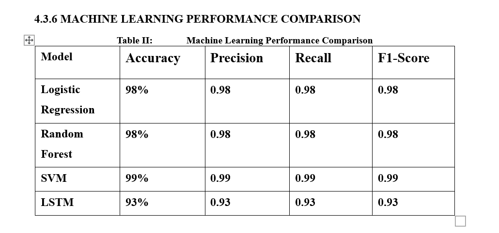

---

## Logistic Regression Confusion Matrix

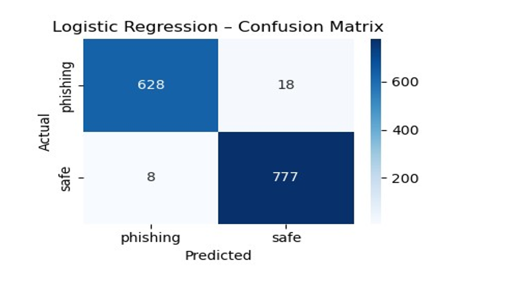

---

## Random Forest Confusion Matrix

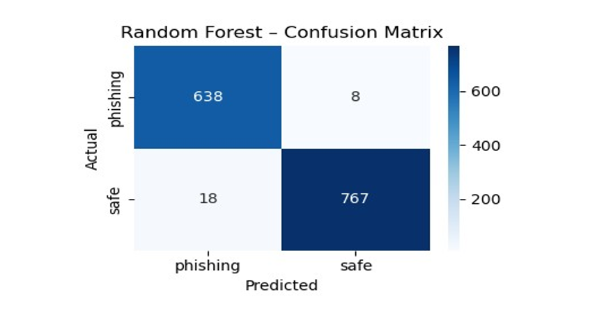

---

## Support Vector Machine Confusion Matrix

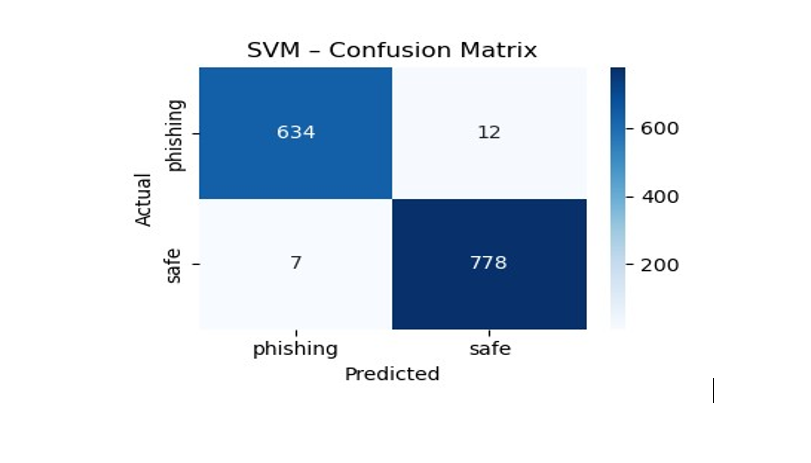

---

## LSTM Confusion Matrix

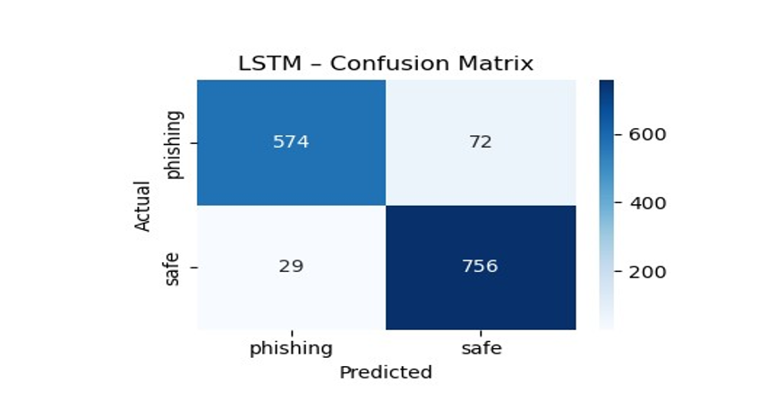

## ROC Curves

### Logistic Regression

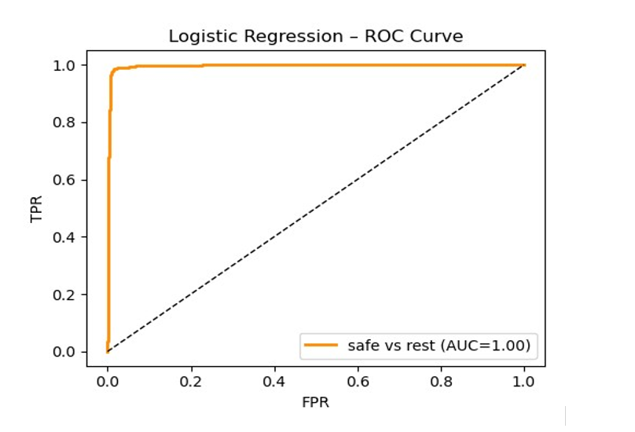

### Random Forest

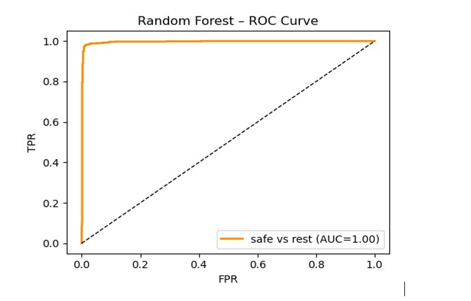

### Support Vector Machine

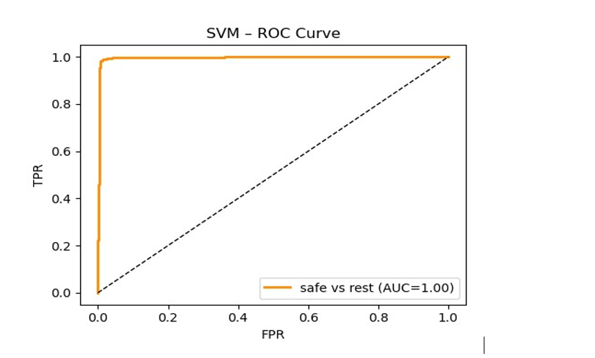

### LSTM

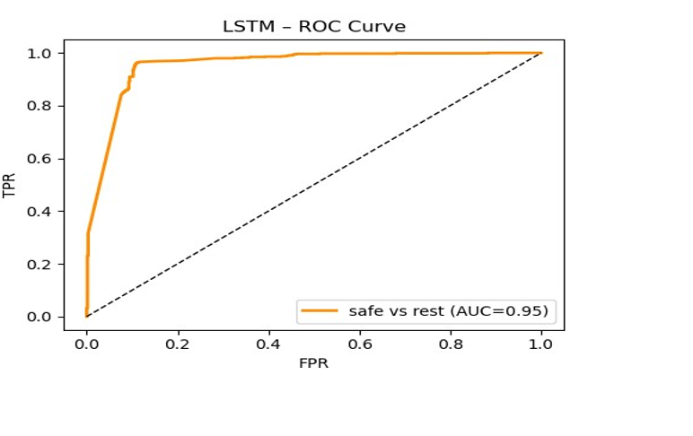

---

## Blockchain Integration Results

The blockchain component of CrypPhish-AI was implemented using Ethereum and Ganache as the local blockchain environment.

The blockchain integration provides a secure and tamper-resistant mechanism for recording the hashes of emails classified as legitimate by the AI-based phishing detection system.

### Ganache Blockchain Network

Ganache was used to create a local Ethereum blockchain for the development and testing of the smart contract. The network generated blocks containing transactions produced during the execution of the system.

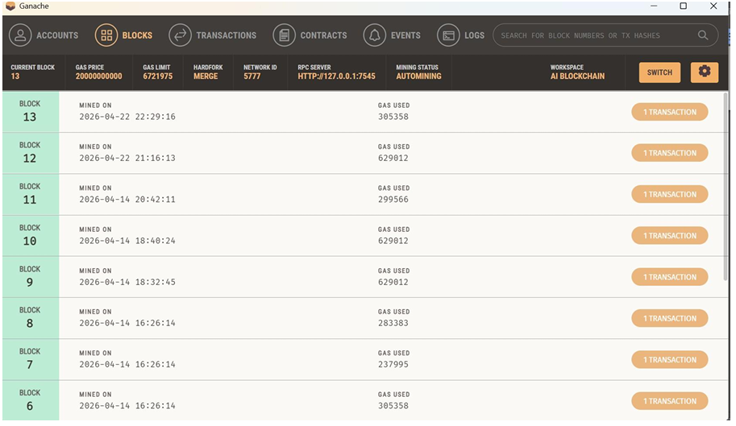

*Figure: Blocks and transactions generated on the Ganache Ethereum blockchain.*

### Ethereum Test Accounts

Ganache provided local Ethereum accounts for testing blockchain transactions. These accounts were used to deploy and interact with the smart contract during the integration of the blockchain component.

*Figure: Ethereum test accounts generated by Ganache for blockchain transactions.*
### Smart Contract Transaction

The integration between the phishing detection system and the Ethereum blockchain was validated through smart contract transactions executed on the Ganache network.

The transaction record shows the transaction hash, sender address, smart contract address, gas consumption, and the block in which the transaction was mined.

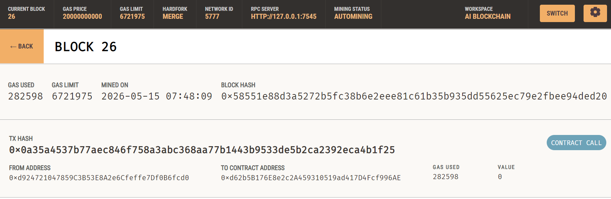

*Figure: Smart contract transaction recorded on the Ganache Ethereum blockchain.*
